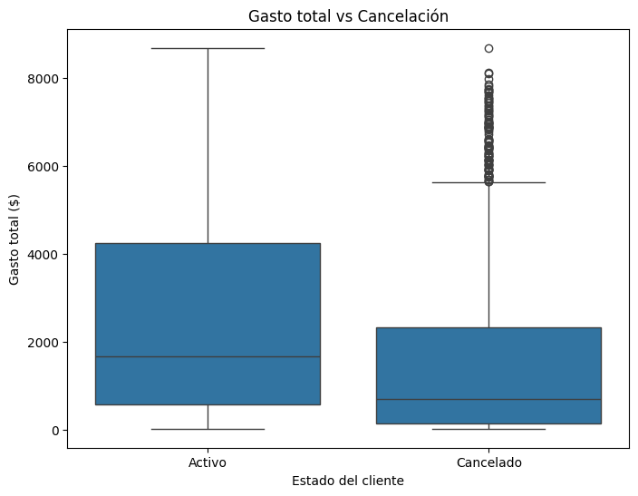
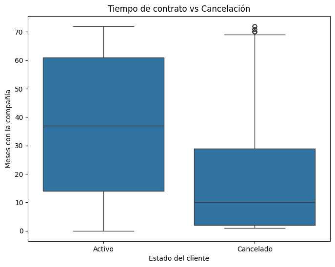

# Proyecto Telecom X - Parte 2

## Propósito del Análisis

El objetivo principal de este proyecto es **predecir el churn (cancelación) de clientes** de Telecom X utilizando variables relevantes del comportamiento y los servicios contratados por los clientes.  
El análisis permite identificar patrones de cancelación, factores clave que influyen en la decisión de los clientes y generar estrategias de retención basadas en datos.

---

## Preparación de los Datos

1. **Clasificación de variables:**

   - **Categóricas:** `Churn`, `customer.gender`, `customer.Partner`, `customer.Dependents`, `phone.PhoneService`, `phone.MultipleLines`, `internet.InternetService`, `internet.OnlineSecurity`, `internet.OnlineBackup`, `internet.DeviceProtection`, `internet.TechSupport`, `internet.StreamingTV`, `internet.StreamingMovies`, `account.Contract`, `account.PaperlessBilling`, `account.PaymentMethod`
   - **Numéricas:** `customer.SeniorCitizen`, `customer.tenure`, `account.Charges.Monthly`, `account.Charges.Total`, `Cuentas_Diarias`

2. **Codificación de variables categóricas:**  
   - Se utilizó **One-Hot Encoding** para transformar las categorías en variables numéricas binarias (`0` o `1`) para compatibilidad con los algoritmos de machine learning.

3. **Normalización:**  
   - Aplicada solo para modelos sensibles a la escala de las variables (Regresión Logística y KNN) utilizando `StandardScaler`.  
   - Modelos basados en árboles (Random Forest) **no requirieron normalización**.

4. **Separación de los datos:**  
   - Se dividió el dataset en **entrenamiento (70%)** y **prueba (30%)** utilizando `train_test_split` de `scikit-learn` con `stratify=y` para mantener la proporción de clientes que cancelaron.

---

## Ejemplos de gráficos e insights obtenidos

1.**Gato total X Cancelación**

   

2. **Tiempo de contrato X Cancelación**  

   
   
---
 
## Modelización y Justificación

1. **Regresión Logística**  
   - Normalización aplicada.  
   - Permite interpretar el impacto de cada variable mediante coeficientes.  
   - Sensible a la escala de las variables, por eso se normalizó.

2. **Random Forest**  
   - No requiere normalización.  
   - Maneja relaciones no lineales y variables categóricas múltiples.  
   - Importancia de las variables calculada automáticamente basada en reducción de impureza.

3. **Justificación de la elección:**  
   - Random Forest se selecciona por su **mayor precisión y capacidad de captura de patrones complejos**.  
   - Regresión Logística se mantiene para interpretación y comprensión de la influencia de cada variable.
  
---

## Instrucciones para Ejecutar el Notebook

1. Abrir **`TelecomX_LATAM-Parte2.ipynb`** en **Colab** .  
2. Cargar los archivos de datos de ventas en el entorno.  
3. Ejecutar las celdas de análisis en orden para reproducir los resultados y gráficos. 
